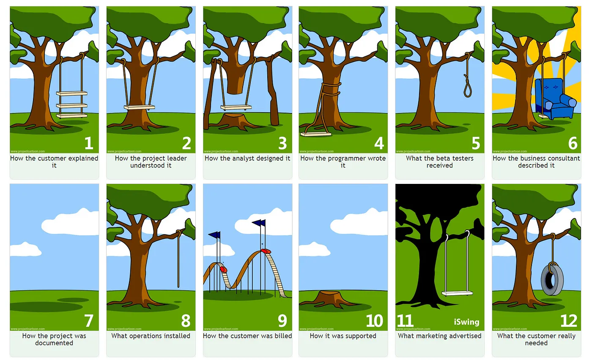

# llama2-finetune

LLAMA-FIT CO.™ - Your LLaMA Will Like The Way It Looks

## Cracking the LLaMa2 Interview: A Weekend Guide to Impressing AI Startups

## Introduction

- **bullets to be turned to memo later**

- street cred maxxing

- impress employers/vc/peoples/ai

- benchmark llama2 fine-tune against base model
  - split training set against validation set (90/10?)
  - benchmark fine-tune against base
    - goal: achieve higher "cosine simularity" (between llama output and validation set) using fine-tuned version than base version
    - (exclaim - oh shit! - I'm a regmonkey) 

## Basic Research

- [LLaMA2 Paper](https://arxiv.org/pdf/2307.09288.pdf)
  - definitive primary source
- [LLaMA2 Github](https://github.com/facebookresearch/llama)
  - actual code
  - not to be confused with llamacode library
    - (aside) spent way to much time trying to figure out why the download code wasn't working ...
  - 7b model
- [Deepgram Video Analysis](https://www.youtube.com/watch?v=Otb7Xi8Z0Oo)
  - good take aimed for layman
- [Karparthy is a Beast](https://github.com/karpathy/llama2.c)
  - look it's clear that I'm not legit until I make it onto the README.md
  - but as a weekend project ... nah ... (at least right now)
- [Fiverr](https://www.fiverr.com/search/gigs?query=LLAMA2&source=top-bar&ref_ctx_id=2ab7ea78dd9c20a111a7363e13a30e50&search_in=everywhere&search-autocomplete-original-term=llama2)
  - there's academic integrity which I adhere to
  - but I'm also technically an entrepreneur ... had the look
    - these rates seems decent
    - side hustle oppurtunity?
- [Random Paper](https://people.cs.umass.edu/~simengsun/paper/rlhf_tech_report.pdf)
  - **Note** remove later
  - literally a random paper I pulled from arxiv talking about training and finetunning
  - insight...
    - [AlpacaFarm](https://crfm.stanford.edu/2023/05/22/alpaca-farm.html)
    - is this useful?
- [Yannic Kilcher segment](https://www.youtube.com/watch?v=xs-0cp1hSnY&ab_channel=YannicKilcher)
  - [Original LLaMA](https://www.youtube.com/watch?v=E5OnoYF2oAk&ab_channel=YannicKilcher)
  - LLaMA-Accessory (potential fine-tune tool)
    - together.ai, openchat, lmsys.org (leverages llama)

## Design Experiment/Hack Minimum Viable Product/Engineered Draft

### Dataset Creation

[Kaggle](https://www.kaggle.com/datasets/sandy1811/data-science-interview-questions)
  - kaggle always have some interesting datasets (interview quetions related)

### Implementation

#### Joke

**Discuss B4 Implementation**

#### Data Processing

  - code in data_processing folder right now
  - create .env with OPENAI_API_KEY=...
  - looking to upload this dataset into huggingface

#### Fine-Tune Framework for Pipeline

[Promising FineTune Framework](https://www.youtube.com/watch?v=eeM6V5aPjhk&ab_channel=1littlecoder)

  - this looks like an out of the box solution
  - cons is that it uses some sharded model of llama 7b, i believe for performance reasons

[Ray Finetune](https://github.com/ray-project/ray/blob/master/doc/source/templates/04_finetuning_llms_with_deepspeed/run_llama_ft.sh)
  - they have code here

[Lambda Labs Finetune](https://lambdalabs.com/blog/fine-tuning-metas-llama-2-on-lambda-gpu-cloud)
  - they have code here

### Benchmarks

[LlamaIndex Semantic Similarity Evaluator](https://gpt-index.readthedocs.io/en/latest/examples/evaluation/semantic_similarity_eval.html)
  - uh thanks...

[MMLU (Massive Multitask Language Understanding)](https://paperswithcode.com/dataset/mmlu)
  - this is probably the benchmark I should riff on

## Initial Proposal

1) choose/create fine-tuning dataset
2) prepare dataset
3) ?choose fine-tuning framework?
4) ?configure fine-tuning process?
5) train the model
6) evaluate the model

## Code

Find at 

https://replit.com/@joexu22/llama2-finetune

https://github.com/joexu22/llama2-finetune

collab notebook?

Deploy_to_Lambda?

Deploy_to_HuggingFace?